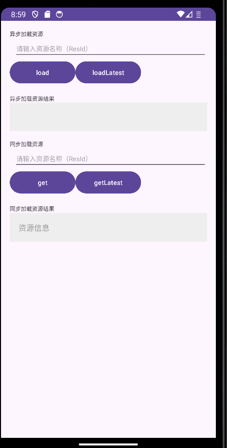

# Shiply-Android-ResDemo
Shiply资源发布使用Demo，Shiply访问地址：https://shiply.tds.qq.com/

[Shiply](https://shiply.tds.qq.com/)是TDS腾讯端服务（Tencent Device-oriented Service）旗下的一站式客户端发布平台，提供了一套规则灵活、发布安全、高效分发的终端基础通用发布系统，功能包括：Android灰度发布，Android热修复、配置与开关发布、资源发布，帮助产品和技术团队提高研效能力和决策力。

## ShiplyResDemo使用说明
本Demo(ShiplyResDemo)主要演示如何快速接入Shiply资源发布SDK，更多细节可以参考https:[Shiply资源发布SDK接入文档](//shiply.tds.qq.com/docs/doc?id=4010893730)

Demo主要包括远端资源拉取和本地配置查询两块：

### 异步获取资源
- 在文本框输入想要拉取的资源名称，点击「load」按钮，开始拉取资源，结果在下方文本框中显示。
- 在文本框输入想要拉取的资源名称，点击「loadLatest」按钮，开始拉取最新资源，结果在下方文本框中显示。

### 同步获取资源
- 在文本框输入想要获取的资源名称，点击「get」即可获取资源相关信息，相关信息会显示在下面的文本框中。
- 在文本框输入想要获取的资源名称，点击「getLatest」即可获取最新资源相关信息，相关信息会显示在下面的文本框中。

SDK初始化代码位于shiplyResDemo/src/main/java/com.example.shiplyresdemo/MyApplication.kt中，Shiply用户可以根据自己的设备、需求修改配置，在shiplyResDemo/src/main/java/com.example.shiplyresdemo/MainActivity.kt文件的onCreate方法中，Shiply用户可以将对应的appId和appKey替换为自己的值，然后进行测试验证。

注意：
需要确保在Shiply前端已经发布了对应的资源，具体操作可以参考[Shiply资源发布SDK接入文档](//shiply.tds.qq.com/docs/doc?id=4010893730)；

